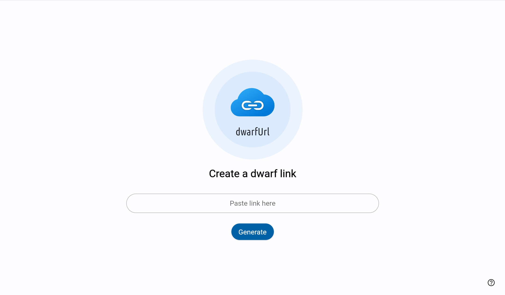
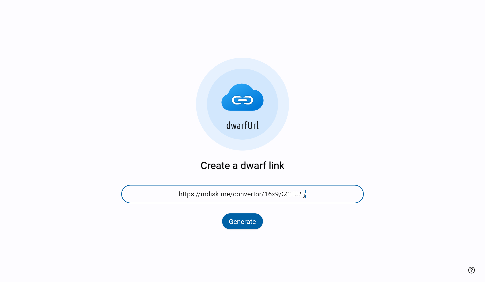
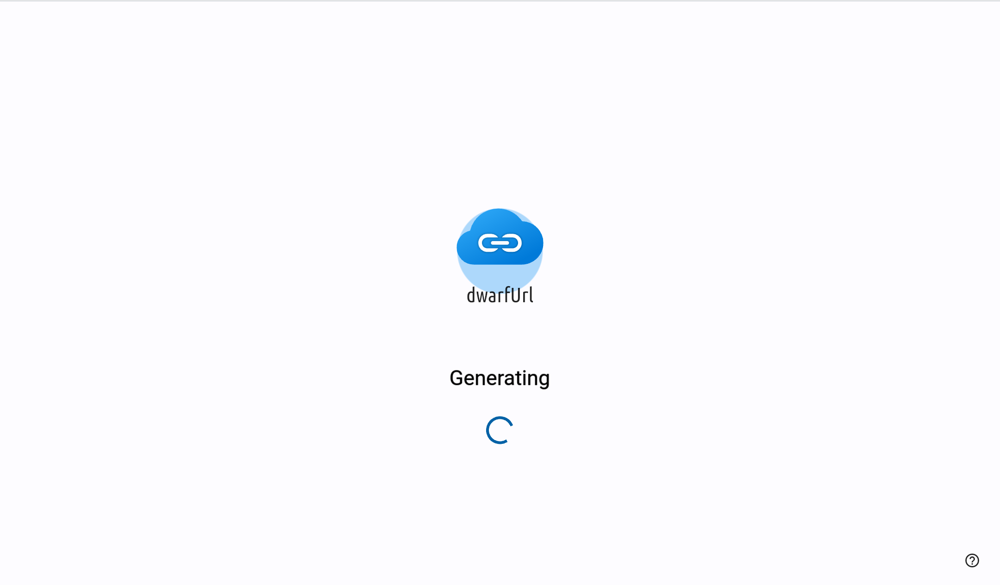
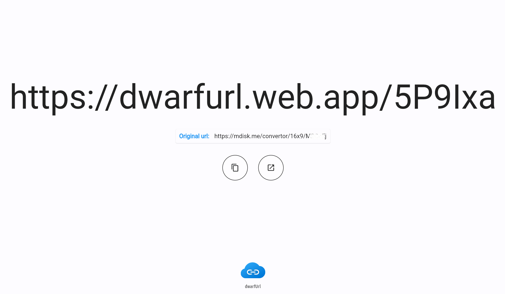

# dwarfurl
dwarfUrl is a link shrinker project that works using firebase as it's core for storing and hosting site data.

## Google Technologies used
- Flutter
- Firebase Firestore
- Firebase Hosting

## Screenshots
| Start | Link inserted | Generating link | Link shortened 
| --- | --- | --- | ---
|  | |  | 
 
## How it works?
 dwarfUrl shortens the URL by sending the original URL to firebase firestore database, with a randomly generated key and returns it. When the user clicks the generated link, the app connects with the firestore database and returns the original URL for the given key. The uses **Deep Linking** for getting the key from the generated URL. Finally the user is navigated to the original website.

## Benefits
- Shorten any long URL
- Avoids the problem of link breaking when sharing
- No ads and unnecessary redirects are available
- No user data is collected (like mail id, etc.,)

## Contributing

If you have read up till here, then 🎉🎉🎉. There are couple of ways in which you can contribute to
the growing community of **dwarfUrl**.

- Pick up any issue marked with ["good first issue"](https://github.com/TamilKannanCV-personal/dwarfurl/issues?q=is%3Aissue+is%3Aopen+label%3A%22good+first+issue%22)
- Propose any feature, enhancement
- Report a bug
- Fix a bug
- Write and improve some **documentation**. Documentation is super critical and its importance
  cannot be overstated!
- Send in a Pull Request 😊
